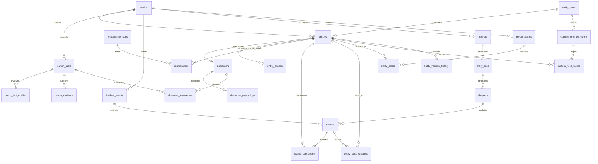

# Euphoriya convergence plan

> **AVISO 2026-10-07: SHELL VISUAL FANTASIA ARCHIVE DESAPROVADO.** O plano abaixo é histórico e sua proposta de usar a interface/shell do Fantasia Archive como base foi anulada. Adotar a [auditoria corrigida](./RESET_AUDIT_2026-10-07.md) e o [contrato visual](./VISUAL_CONTRACT_V0.md) como ponto de partida. Preservar apenas conceitos e dados avaliados, não a aparência.

## Decision summary

- **Product:** one Euphoriya Studio desktop product, not three co-launched applications.
- **Temporary application shell:** Fantasia Archive's existing Vue/Quasar/Electron shell, IPC boundary, project lifecycle, media workflows, and quality gates.
- **Canonical domain:** a new relational Euphoriya model. Do not declare existing Fantasia documents, Narra records, or Loreum entities canonical by default.
- **Primary store:** SQLite, one project database file, evolved through tested, additive migrations. Keep project media as files and put references/metadata in SQLite.
- **Source trees:** keep `narra/` and `loreum/` in place as read-only analysis/import sources during convergence. Do not add their runtimes or start their apps in parallel.
- **First feature:** a focused Character Studio MVP, after the model foundation and safe migration boundary. This document is the design baseline; changes to it require updating the source audit and license map.

## What to keep, adapt, rewrite, and exclude

| Source | Keep | Adapt/rewrite for Euphoriya | Do not bring into the desktop core |
| --- | --- | --- | --- |
| Fantasia Archive | Electron/Quasar/Vue shell; secure main/preload/renderer separation; project open/create/recent-file flow; SQLite connection ownership; typed IPC; UI component patterns, localization, and existing test infrastructure | Character workspace, entity browser, persistence/domain APIs, project media references, adapters, backups, and database schema become Euphoriya-native. Preserve project/document compatibility until tested migrations exist. | Treating current templates/documents as the final domain model; pretending planned custom fields are shipped; direct renderer filesystem/database access. |
| Narra | Behavioral requirements and selected independently specified ideas: psychology categories; directional knowledge/beliefs and learning provenance; temporal narrative context; graph/continuity test cases | Implement normalized knowledge, canon, relationships, state history, and graph traversal in TypeScript/SQLite first. Re-evaluate embeddings/advanced analytics feature by feature against latency, bundle size, licensing, and offline requirements. | A second permanent CLI/SurrealDB/RocksDB store, blanket port of the service tree, automatic LLM assertions, or Rust sidecar before a demonstrated capability gap. |
| Loreum | Feature references: shared entity types, visible relationship graph, timeline, wiki, story outline, custom schemas, and MCP workflows | Rebuild only selected workflows against Euphoriya's domain, UI, offline database, and access model. Use import/export adapters for source data. | Its web app/API/PostgreSQL/Redis/OpenSearch/R2 deployment, hosted accounts/billing, cloud OAuth, or modules copied wholesale. Do not reuse AGPL implementation code without explicit licensing approval. |

No new integrations, source-code merges, or cloud/sidecar dependencies are part of this convergence foundation.

## Proposed Euphoriya data model

Each `.faproject` remains one offline project database. A project may contain multiple worlds; all world-owned rows reference `world_id`. IDs remain stable TEXT UUIDs, timestamps are UTC Unix milliseconds (`*_at_ms`) to match the host application, and foreign keys are enabled on every connection.

### Core tables and invariants

| Table | Core columns/role |
| --- | --- |
| `entity_types` | `id`, stable `key`, localized/display name metadata, optional parent type, schema version/timestamps. Seed Character, Species, Race, Clan, Family, Faction, Organization, Location, Item, Artifact, Creature, Ability, MagicSystem, Culture, Religion, and future user-created types. Types are extensible data, not a closed code enum. |
| `entities` | `id`, `world_id`, `type_id`, `name`, unique world-scoped normalized `slug`, `summary`, `description`, `canon_status`, timestamps. The stable identity shared by relationship, tag, media, reference, and search features. |
| `entity_aliases` | Entity FK, alias text and normalized key, uniqueness within world/entity lookup policy. Avoid an opaque aliases JSON field. |
| `relationship_types` | Extensible relationship key/label, optional inverse type, symmetry policy, and system/user ownership. Seed relationship concepts such as parent/child and friend/enemy without baking them into a closed source-specific enum. |
| `characters` | `entity_id` PK/FK to `entities`, structured identity fields such as status/species reference/age/role where stable fields are justified. |
| `character_psychology` | `character_id` PK/FK; desire, need, wound, fear, contradiction, secret, motivation, values, internal conflict, external goal. Optional long text can be nullable; custom profile details stay in custom fields. |
| `relationships` | `id`, world, source and target entity FKs, `relationship_type_id`, optional display label, directionality, `valid_from` / `valid_until` display values plus comparable numeric story-time values when available, canon status, notes, created/updated timestamps. Store one directed edge; render an inverse only when the relation definition explicitly says it is symmetric. Validate endpoints belong to the same world. |
| `canon_facts` | `id`, world, statement, status, validity labels plus comparable numeric story-time bounds when available, notes, stable current version number and timestamps. Draft/unreviewed by default. |
| `canon_fact_entities` | Fact/entity junction plus role such as subject, object, or witness. Composite uniqueness prevents duplicate involvement. |
| `canon_evidence` | Fact FK, evidence kind and source locator/reference, optional source entity/media/document FKs, quoted excerpt/notes, created timestamp. Keep provenance distinct from the claim and require at least one resolvable source or an explicit external citation. |
| `character_knowledge` | Character/fact FKs, state, optional learning event/scene/source-entity FKs, confidence constrained to `[0,1]`, notes and timestamps. Unique character/fact pair is the current state; `KNOWS`, `SUSPECTS`, `BELIEVES`, `BELIEVES_WRONGLY`, `DENIES`, `FORGOT`, `UNKNOWN`. Never inferred from prose. |
| `timeline_events`, `eras` | World-owned ordered intervals with explicit calendar/date precision and optional source references. Store canonical numeric/order representation separately from display strings to support custom calendars. |
| `stories`, `story_arcs`, `chapters`, `scenes`, `plot_threads` | Relational writing plan, ordered parent-child structure, plot-thread links, timeline and location references, scene text/notes, and explicit scene/entity participation. |
| `entity_state_changes` | Entity + scene/event FK, stable field key, typed old/new value or validated JSON scalar, reason, order/timestamp. Immutable facts in scene order; “current state” is a projection of baseline plus ordered changes, not an overwritten value that forgets history. |
| `media_assets`, `entity_media` | Asset metadata (relative path, media type, title, description, hash, canon status, optional story period) and a many-to-many entity junction. Keep large image/audio/video bytes outside SQLite. |
| `tags`, `entity_tags` | World-scoped labels and an entity junction, with normalized uniqueness and cascading cleanup rules. |
| `custom_field_definitions` | Stable field ID, entity type scope, key, type, label, sort order, required flag, validation/config metadata and soft-delete timestamp. Structural columns (especially `entities.name`, IDs, type, canon, and relationships) are never custom fields. |
| `custom_field_values` | Entity/field composite identity and typed scalar columns for text, long text, number, boolean, date, select, multi-select/config values; CHECK exactly one scalar representation. Reference-list and media fields use typed junction tables with real FKs, not IDs hidden in JSON. Retain orphaned values after soft-delete for recovery. |
| `entity_version_history` | Entity FK, monotonically increasing version, operation, changed-at/actor/source, structured before/after snapshot and reason. JSON is allowed for immutable history snapshots, not as the canonical live entity store. |
| `euphoriya_search` (FTS5) | FTS index for entity labels/aliases/descriptions, canon statements, lore, events, stories, arcs, chapters, scenes, and relationship labels/notes. Maintain from relational sources using transaction-safe triggers or explicit repository writes; rebuild and integrity tests are required. |

**Canon statuses:** `DRAFT`, `PROPOSED`, `CANON`, `DISPUTED`, `RUMOR`, `RETCONNED`, `DEPRECATED`. New entities, imported rows, evidence, and AI suggestions start `DRAFT` or `PROPOSED`; none become `CANON` implicitly. A retcon creates a new fact/version and preserves superseded history and evidence.

**Temporal relationships:** `valid_from` and `valid_until` describe story-world validity, not just row creation. Character-knowledge provenance points to an event/scene where known. Scene-state changes are ordered, preserve previous/new values, and are evaluated as-of a scene to support later continuity checks.

**JSON boundaries:** retain JSON only for validated custom-field configs, localization/config metadata, external source references, and immutable version snapshots. IDs, ownership, entity links, relationship edges, canon/evidence, knowledge, timeline ordering, and search source rows remain relational with foreign keys and indexes.

## Storage decision

**Choose SQLite as the single desktop core store.** This extends the already shipped one-file-per-project database and matches offline-first, portable backup/restore, relational integrity, and Electron packaging. `better-sqlite3` is already present and owned by Electron main; no second runtime or database dependency is required. Keep writes transactional, foreign keys on, migrations numbered/idempotent, and use FTS5 for local global search.

| Candidate | Strengths | Trade-offs for Euphoriya | Decision |
| --- | --- | --- | --- |
| **SQLite + FTS5** | Single portable file; offline; transactions, indexes, foreign keys; straightforward copy/backup; native dependency already shipped; local full-text search. | Single-writer design; no built-in multi-device collaboration; filesystem media needs coordinated backups; FTS is lexical, not semantic. | **Adopt** for canonical desktop project data. Verify FTS5 in the packaged Electron SQLite build and keep semantic search optional/later. |
| PostgreSQL (Loreum) | Excellent server concurrency, constraints, hosted multi-user operation, established migration tooling. | Requires a service and deployment; breaks self-contained offline `.faproject`; duplicates the active model and stack. | Do not use as the local desktop source of truth. Revisit only for a separately designed sync/server product. |
| SurrealDB/RocksDB (Narra) | Local embedded graph-oriented records, Rust query layer, Narra's existing graph/embedding algorithms. | Adds a second database file/runtime and Rust sidecar; graph/search benefits do not justify split ownership of canon and desktop project data. | Keep as isolated source/reference; migrate selected behavior to SQLite/TypeScript first. |
| JSON document/blob | Convenient flexible export and metadata. | No relational ownership, reliable cross-record constraints, efficient partial updates, or dependable concurrent-safe domain queries; giant world files make migrations and recovery fragile. | Reject as primary store; use JSON only at defined metadata/import/export boundaries. |

## Migration and backup plan

1. **Audit and design first.** This document does not authorize changing existing `.faproject` files. Capture the current schema/version and write source-to-target maps and fixtures before a data migration.
2. **Add a backup gate before any live migration.** Use SQLite's online backup API from the open connection (not a raw file copy while a database may be active). Write a timestamped sibling backup to a temporary name, verify `PRAGMA quick_check`/`integrity_check` and `foreign_key_check`, then atomically finalize it. Never overwrite the only known-good backup; initially retain migration backups rather than silently pruning them.
3. **Migrate a staged database copy.** Close/flush the active handle as required by Windows file semantics, apply migrations to a working copy in a transaction, validate constraints/indexes/search, and only then atomically promote the validated file while retaining the source backup. If staging or validation fails, discard only the staging file and reopen the untouched original.
4. **Keep Fantasia compatibility.** Support existing schema versions 1-11. Add an explicit numbered migration only after backup/restore and fixture tests exist. Do not rewrite existing tables in place or auto-convert all documents on open.
5. **Preview adapter output.** `FantasiaAdapter`, `NarraAdapter`, and `LoreumAdapter` are one-way import/export/validate/map boundaries, not runtime dependencies of domain logic. Emit counts, warnings, deterministic ID mappings, unresolved links, and proposed canon changes for user review.
6. **Map conservatively.** Preserve valid source IDs where they do not collide; otherwise persist a deterministic mapping and the source ID. Do not infer Character from an arbitrary template/type label without an explicit mapping. Keep every imported canon state non-canonical (`DRAFT`/`PROPOSED`) until the user approves it. Preserve source backups and do not delete source directories.
7. **Test and restore.** Exercise duplicate names, dangling/cross-world references, relationship targets, media path/hash validation, timestamp/order stability, migrations from every supported version, rollback/reopen, backup restore, FTS rebuild, and “no imported content becomes CANON.” Add `integrity_check` and `foreign_key_check` to migration verification.

## Source capability mapping

| Source capability | Euphoriya target |
| --- | --- |
| Fantasia world/template/project shell | Euphoriya desktop shell/project lifecycle; legacy worlds/documents retained through explicit import mapping |
| Fantasia template definitions and approved field design | `entity_types`, stable-ID `custom_field_definitions`, typed values, and typed relation junctions |
| Fantasia document tags/media/hierarchy | world-scoped entity tags, filesystem-backed `media_assets`, and a separate navigational hierarchy where still useful |
| Narra character psychology/profile | Character Studio `character_psychology` and optional custom fields |
| Narra fact + knowledge state/provenance | Separate `canon_facts`, `canon_evidence`, and per-character `character_knowledge` |
| Narra relationship graph/path/impact | `relationships` plus indexed SQLite/TypeScript traversal and later integrity/continuity analysis |
| Narra events, scenes, arc snapshots, phases | Euphoriya timeline/story/scene/plot-thread/state-change relations; port algorithms only after tests define desired behavior |
| Loreum base entity + entity types | Euphoriya `entities` and data-driven `entity_types` |
| Loreum relationship graph | Euphoriya first-class `relationships` and later graph visualization |
| Loreum timeline/eras/custom calendar | Euphoriya `timeline_events`/`eras` with calendar-aware ordering |
| Loreum wiki articles/tags | Euphoriya world bible/lore records, FTS5, canonical-status/evidence links, entity tags |
| Loreum plotlines/works/chapters/scenes | Euphoriya `stories`, `story_arcs`, `chapters`, `scenes`, `plot_threads`, and participants |
| Loreum remote MCP/API and Narra local MCP | A later explicit, permission-scoped Euphoriya desktop MCP adapter over the canonical domain services |
| Loreum cloud media | Local project media library with validated relative paths and content hashes |

## First implementation — Character Studio MVP

After the foundation and backup/migration decision are reviewed, the MVP should use these narrow vertical slices:

1. **Storage contracts/schema:** new Euphoriya SQLite tables for extensible entity types, entities, character specialization/psychology, relationships, knowledge/facts, media references, canon, and basic entity version history. Initially additive and behind an explicit versioned migration/backup gate; do not mutate a user database during this design step.
2. **Electron main domain service:** validate typed input in main, run transaction-safe repository operations on the active project database, expose minimal typed IPC through `electron-ipc-bridge.ts`, register handlers in the existing project-content registration flow, and expose only the domain API from sandboxed preload.
3. **Renderer contracts and UI:** shared `types/` DTOs, a focused Character Studio page/dialog with overview/identity/psychology/relationships/knowledge/canon/media tabs or sections; save a Character as an Euphoriya entity plus specialization, never as a standalone Narra/Loreum object. Avoid building every tab at once.
4. **Tests:** actual `better-sqlite3` in-memory schema/repository integration tests; IPC validation/error tests; view-model/UI tests. Assert foreign keys, same-world relationships, knowledge provenance, stable IDs, media references, version history, and default non-CANON.

Initial code/file candidates (follow existing conventions and refine after the vertical-slice API is chosen):

- `src-electron/mainScripts/euphoriyaData/` — original Euphoriya schema/domain service/repository wiring, not imported source code.
- `src-electron/mainScripts/projectManagement/faProjectDbMigrateWiring.ts` and backup/restore wiring — only when a tested, backed-up additive migration is ready.
- `src-electron/electron-ipc-bridge.ts`, `src-electron/mainScripts/ipcManagement/`, `src-electron/contentBridgeAPIs/`, `src-electron/electron-preload.ts` — typed and allowlisted IPC.
- `types/I_euphoriya*.ts`, `src/pages/CharacterStudio/`, focused components/stores/routes, and matching Vitest/Storybook tests.
- `docs/database/projectDB.md`, this plan, and the source/license map — update with each shipped schema/API phase.

The existing `.faproject` document/content model is not silently renamed or deleted. If entity tables coexist with existing document tables during transition, their distinct semantics and adapter mapping must stay explicit until compatibility and recovery tests pass.

### Foundation work started after the audit

The initial implementation now defines the Euphoriya canon/knowledge unions and an idempotent SQLite schema module under `src-electron/mainScripts/euphoriyaData/`. Its first relational slice covers entity types/entities, characters/psychology, same-world relationships, timeline/scene anchors for knowledge provenance, canon facts/evidence, knowledge, media references, typed custom-field storage, version history, and FTS5 triggers for entities, aliases, relationships, and canon facts. Schema tests are authored against in-memory SQLite.

This module is deliberately **not yet invoked by project creation/open or the live v1-v11 migration ladder**. That connection is gated on a tested online backup/restore and staged migration flow; no user's `.faproject` file is modified by this foundation step. FTS5 availability must still be verified against the packaged Electron SQLite native build.

## Ordered delivery gates

1. Source audit and feature matrix.
2. Convergence/data-model/storage/licensing documentation (this phase).
3. Review the entity schema and SQLite/FTS assumptions.
4. Implement and test SQLite backup/restore and staged migration before touching user data.
5. Add the smallest additive, versioned Euphoriya schema foundation.
6. Character Studio MVP vertical slice.
7. Relationships, then character knowledge/canon/evidence.
8. World database, stories/scenes, timeline.
9. Graph/search enhancements and continuity engine.
10. World bible and explicit, permissioned AI/MCP surface.

Every gate preserves backups, license provenance, tested IPC boundaries, and the principle that import or AI never makes data canon automatically.
